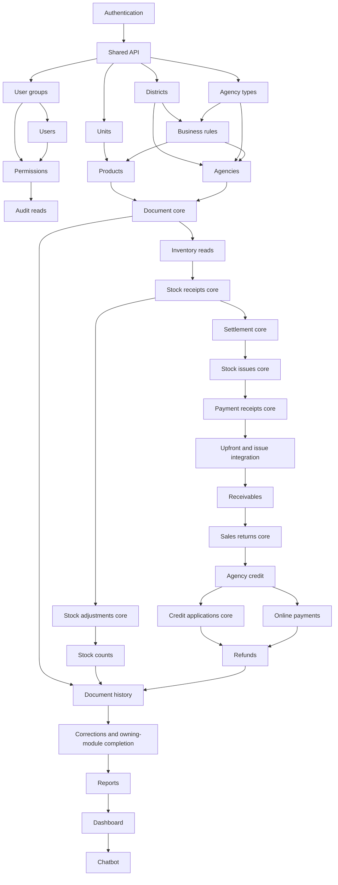

# General Plan

**Backend implementation order, module dependencies, and completion gates**

**Updated:** 2026-10-01. **Current next module:** `authentication`.
**Status:** roadmap; business HTTP APIs and authentication are not implemented yet.

Track slice progress, deferred integrations and release evidence in the
[Backend General Checklist](GENERAL_CHECKLIST.md). Per-function details remain in
the owning module checklist and verification log.

## 1. Where to start

Start with [the authentication plan](plan/authentication/PLAN.md), then shared API
conventions and account administration, then master data, then document/ledger
workflows, and finally reporting and chatbot integration.

```text
Existing infrastructure and reviewed database
  -> Authentication and reusable authorization
  -> Shared API conventions + account/group/permission administration
  -> Master data and dealer management
  -> Document core + inventory + stock receipts
  -> Settlement core + stock issues + receipts + upfront integration
  -> Inventory counts + returns + credit + online payments + refunds
  -> Cross-document corrections + complete history/printing
  -> Reports + dashboard + chatbot
```

This is a recommended delivery order, not a claim that every earlier module is a
hard dependency of every later module. The dependency column in §3 is authoritative
for prerequisites; unrelated modules can be developed independently once their
prerequisites pass. A module spanning multiple slices is complete only after all
its source API operations and integration gates pass.

## 2. Sources and existing baseline

Read the sources before creating each module's detailed plan:

- [BA requirements](../BA/DMS_exploration.md): BM/QĐ, especially account/RBAC/audit
  and goods/payments/report requirements.
- [Database design](../database-design/README.md) and
  [business decisions](../database-design/business_decision_making.md): selected
  workflow, snapshot, FIFO, historical consistency, return/credit/refund rules.
- [DBML](../database-design/DMS.dbml) and
  [immutable initial DDL](../../backend/alembic/sql/0001_initial.sql): exact schema.
- [Target backend API](API/openapi.json): paths, operation IDs, schemas, permissions,
  preconditions, idempotency, and errors. Its business operations are future work.
- [Backend guidance](../../backend/AGENTS.md) and
  [verification workflow](../../.agents/workflows/verify.md): implementation conventions.

Already implemented: FastAPI application factory, settings, synchronous sessions,
liveness/readiness, Alembic revisions `0001`/`0002`, all 29 domain tables and SQL
guards/read models, core groups/function grants, full repeatable demo seed and SQL
verification. Preserve this baseline. Do not rebuild the database or edit deployed
snapshots to start a business module. HTTP services/ORM mappings still need work.

The baseline seed is useful for smoke tests, not a substitute for isolated fixtures,
service implementations, or transaction/concurrency tests. SQL routines protect
data; backend services must still construct complete authorized workflows.

## 3. Ordered implementation map

`Mxx` identifies an implementation slice; `module_name` identifies its future plan
folder `plan/<module_name>/`. Dependencies are direct prerequisites, with earlier
dependencies inherited transitively. Only the authentication plan exists today.
All other folder names below are proposed; create their detailed plan before code.

### Wave A — Access and shared API foundations

| Step | Module / slice | API scope / deliverable | Depends on | Completion gate |
| --- | --- | --- | --- | --- |
| M01 | `authentication` | Authentication: seven `/auth/*` operations, live bearer/session checks, reusable allOf/anyOf RBAC, safe errors/request IDs, auth throttling and reset delivery. | Existing baseline | Complete [PLAN](plan/authentication/PLAN.md), [TESTS](plan/authentication/TESTS.md), [CHECKLIST](plan/authentication/CHECKLIST.md) and evidence gates; real rotation/reset/invalidation races. |
| M02 | `shared_api` | Reuse auth plumbing for business errors; exact numeric/ID/date serialization, cursor/sort validation, ETag/If-Match/If-None-Match, operation-aware idempotency and rate-limit interfaces. | M01 | Contract-compatible helpers; stale/missing preconditions and duplicate/conflicting retries tested; no writes or migrations at API startup. |
| M03 | `user_groups` | User Groups: group list/detail/create/update/delete. Atomic grant cleanup on eligible deletion. | M02 | Referenced ACTIVE or LOCKED users block deletion; unreferenced group/grant cleanup audited and atomic; concurrent assignment/deletion tested. |
| M04 | `users` | Users: account list/detail/create/update, lock/unlock/group change, administrative password reset. | M03 | Case-insensitive unique email, hash-only credentials, group FK, ETags; all affected sessions invalidated in the write transaction; no implicit unlocking on password reset. |
| M05 | `permissions` | Permissions: read-only function registry, group grant reads/set using source allOf/anyOf rules and create/update preconditions. | M03, M04 | Missing/false grants denied; updates affect next request without stale cache; MANAGEMENT has no bypass; audit and concurrency/precondition tests pass. |
| M06 | `audit_logs` | Audit Logs: list/detail of immutable, credential-redacted audit entries. | M05 | Authorized read only; safe filters/keyset pagination; correct actor/function/request correlation; no edit/delete API. |

Authentication reads already-seeded groups/grants and therefore does **not** depend
on their administration endpoints. The write-audit context is delivered in M01;
business mutations need not wait for the M06 audit-browsing API to record audit.

### Wave B — Business master data

| Step | Module / slice | API scope / deliverable | Depends on | Completion gate |
| --- | --- | --- | --- | --- |
| M07 | `districts` | Districts: list/detail/create/update/delete; active state and capacity visibility. | M02 | Referenced districts cannot be deleted; inactive districts cannot receive new active agencies; cap comes from business_rule, not a new district attribute. |
| M08 | `agency_types` | Agency Types: list/detail/create/update/delete and credit limits. | M02 | Current debt blocks lowering maxDebt; referenced types, including terminated agencies, block deletion; history snapshots unaffected. |
| M09 | `units` | Units: list/detail/create/update/delete; allowsFraction policy. | M02 | Fraction policy and referenced-unit deletion enforced; unit meaning cannot change after recorded use. |
| M10 | `business_rules` | Business Rules: read/update singleton agency capacity and selling-price rate. | M07, M08 | Explicit locks/ETags; reject cap below active agency count; Decimal precision/range; changes audited and do not rewrite historical snapshots. |
| M11 | `products` | Products: list/detail/create/update/delete; unit, thresholds, current stock and calculated selling price. | M09, M10 | No client-written balances/prices; active-unit rules; recorded product unit cannot change; deletion/reference and precision tests. |
| M12 | `agencies` | Agencies: list/detail/create/update/delete/terminate. | M07, M08, M10 | Atomic district cap and credit-limit checks; zero initial balances, immutable code, no reopen of TERMINATED agency; transaction history blocks deletion. |

M07/M08/M09 can proceed independently after M02. Implementation plans for catalogue
changes must test existing seeded transaction references even before their HTTP
transaction modules exist. Do not assume early catalogue work has an empty DB.

### Wave C — Documents and core goods/cash workflows

| Step | Module / slice | API scope / deliverable | Depends on | Completion gate |
| --- | --- | --- | --- | --- |
| M13 | `document_core` | Shared identity/revision/line mappings and services; Document History draft-line CRUD foundation, parent ETags, snapshots, Decimal totals, creation keys, batch/reversal primitives and kind-to-permission dispatch. | M11, M12 | Correct parent/revision/line ownership; one product per revision; no changes to READY/POSTED content; financial documents reject goods lines; draft edits remain balance-neutral. |
| M14 | `inventory` | Inventory: `/products/{productId}/inventory-entries` statement and reusable stock read service; product overview remains owned by products. | M13 | Business-date/order balances, effective/reversed entries and opening totals correct; inventory.read enforced; seeded fixtures can verify reads before new posting endpoints. |
| M15 | `stock_receipts` — core | Stock Receipts: list/detail/create/draft update/post; draft cancellation. Add the STOCK_RECEIPT draft-line dispatcher in document_core. | M14 | Atomic positive inventory posting and latest-business-date purchase-price source; concurrent writes, snapshot/quantity validation, no success before commit. Posted corrections/cancellation close in M29. |
| M16 | `settlement_core` | Internal receivable charges/FIFO allocations, AUTO_FROM_ISSUE and RECEIVED_UNAPPLIED receipt posting, credit provenance/lots and reserve/release/consume primitives. No separate public allocation CRUD. | M15 | Real-PG fixtures prove same-agency/source integrity, historical no-overpay/FIFO, nonnegative debt/credit, reservation exclusion and rollback; reusable primitives do not commit caller transactions. |
| M17 | `stock_issues` — core | Stock Issues: list/detail/create/draft update/submit, pending revision replacement without received-money dependencies, zero-upfront posting, draft cancellation without money evidence. | M16 | ACTIVE agency/master rules; READY price snapshots fixed; post rechecks stock/current limit; no stock/debt reservation at submit. Money-dependent paths close in M19; posted correction/cancel close in M29. |
| M18 | `payment_receipts` — core | Payment Receipts: list/detail/create/draft update/post; draft cancellation. Expose manual DEBT_COLLECTION, reuse internal posting for other receipt kinds. | M17 | FIFO at businessDate, no future invoice payment/manual overpay; no standalone edit/cancel of automatic or online receipts; posted correction/cancel close in M29. |
| M19 | `upfront_payments` + stock-issue money integration | Upfront Payments: confirmation list/detail/verify/receive-separately; finish Stock Issues post with upfront payment and pending replacement after evidence separation. | M18 | Issue + automatic receipt + inventory/debt + CONSUMED atomic; VERIFIED alone balance-neutral; failed delivery retains evidence; separate receipt records full money and excess credit; retries cannot double count. |
| M20 | `receivables` | Receivables: overview, agency balance, invoice balances, statements, document allocations; expose `/agencies/{agencyId}/balance` once as the shared Receivables/Agency Credit resource. | M19 | Original remainder differs from current outstanding; settled means obligation settled, not necessarily new cash; same-day atomic balance and effective-entry pagination correct. |

**Avoid a circular dependency:** M16 supplies internal receipt/credit machinery;
M17 supplies source invoices and READY issue records; M18 exposes manual receipts;
M19 adds the cross-module upfront paths. The entire stock_issues module is still
partial after M17, not falsely marked complete before its M19/M29 gates.

Keep write services separated by responsibility, but compose one caller-owned
transaction for cross-module posting. Never make an internal HTTP request to another
module's endpoint to complete an atomic operation.

### Wave D — Counts, returns, credit and external payments

| Step | Module / slice | API scope / deliverable | Depends on | Completion gate |
| --- | --- | --- | --- | --- |
| M21 | `stock_adjustments` — core | Stock Adjustments: list/detail/create/draft update/post and draft cancellation; add adjustment line dispatcher. | M15 | Signed nonzero deltas, reason required, no sales/charge or purchase-price source change; historical nonnegative stock; independent posted corrections/cancel close in M29. |
| M22 | `stock_counts` | Stock Counts: headers/lines/recount/confirm; invokes internal adjustment posting for nonzero differences. | M21 | Capture bookQuantity and last-entry identity; stock changes that return to same quantity still stale; recount requires new observations; zero-difference lines retained with no empty adjustment; conditional posting permission enforced. |
| M23 | `sales_returns` — core | Sales Returns: list/detail/create/draft update/post/draft cancel; add origin-linked return line dispatcher. | M20 | Cumulative rounding and quantity cap; original selling-price provenance; stock/debt/credit split atomic; real return date, no automatic refund; posted correction/cancel close in M29. |
| M24 | `agency_credit` | Agency Credit: credit-lot/detail/entry reads and shared available-credit service; reuse M20 agency balance rather than duplicate its route. | M23 | Separate debt/credit; origin receipt provenance; reserved vs available credit, current vs historical balances and permissions correct. |
| M25 | `credit_applications` — core | Credit Applications: list/detail/create/draft update/post and draft cancellation. | M24 | Available unreserved same-agency credit + invoice FIFO; preserve source provenance; cashReceived=0; concurrent consumption/reservation tests; posted correction/cancel close in M29. |
| M26 | `online_payments` | Online Payments: create/read/list/events/reconcile and provider-signature webhook; sandbox adapter only. | M24 | Commit PENDING before provider call; verified signature/amount/reference; duplicate and late success record one full receipt, FIFO debt and excess credit; browser return is not payment proof; no network under DB locks. |
| M27 | `refunds` | Refunds: draft/read/list/update/submit/confirm-paid/cancel, reservations, online attempts/detail/reconcile; cash/bank first, online after adapter integration. | M25, M26 | One source receipt per refund; reserve before sending; UNKNOWN retains reservation; confirmed failure releases; success posts/debits/consumes once; refunded money cannot be canceled; retry uses source-defined fresh revision/attempt. |

Stock adjustments/counts can proceed independently of cash workflows after M15.
Returns and online payments both use M16 settlement primitives. Refunds are last in
this wave because they must prove that money reserved or already refunded cannot
also be consumed through credit applications or lose its source provenance.

### Wave E — History, cross-workflow correction, and read products

| Step | Module / slice | API scope / deliverable | Depends on | Completion gate |
| --- | --- | --- | --- | --- |
| M28 | `document_history` | Complete Document History search/revision/line reads, kind-specific draft-line CRUD and snapshot printing with HTML/PDF content negotiation. | M13, M22, M27 | Permissions filter by kind; explicit unauthorized kind rejected; historical revisions readable and immutable; print historical snapshots, clearly mark draft/canceled versions; all goods-kind dispatchers wired. |
| M29 | `document_corrections` + owning-module completion | Shared replay orchestration and domain-specific posted corrections/cancel for stock receipts/issues, manual payment receipts, independent adjustments, returns and credit applications. Endpoints retain their owning API tags/modules. | M28 | Reverse old effects + new revision + downstream FIFO/return/credit replay atomic; full historical and current limits respected; preserve actual received/refunded money and reservations; corrections use original business period, not new sale/return fiction. |
| M30 | `reports` | Reports: sales/debt/inventory/product-sales/cash-and-credit, JSON and full-filter XLSX/PDF exports. | M29 | Reconcile ledger and snapshot totals after corrections; original-period reversal, return period, cash vs credit distinguished; half-open dates, consistent totals/filter denominator; same permissions for JSON/export. |
| M31 | `dashboard` | Dashboard: monthly authorized sections, current balances, pending/VERIFIED money, charts and top lists. | M30 | Per-section permissions/no leaks; no double-counting unreceipted upfront money; current balance not confused with period flow; source top-10 limits. |
| M32 | `chatbot` | Chatbot: debt/inventory/sales query whitelist and agency disambiguation, using authorized read services. | M31 | Same debt.read/inventory.read/sales.read checks; no mutation/arbitrary SQL; duplicate names require code selection; unsupported vs clarification responses conform to API. |

Reports/dashboard/chatbot may have early read-only prototypes against seeded data
once their underlying readers and RBAC pass, but their **full completion gates**
above require integrated transaction/correction evidence. Chatbot reads services,
not dashboard HTTP; M31 is the recommended final integration/validation prerequisite.

## 4. Dependency graph

Arrows mean "must pass before this slice can be completed." This graph is acyclic
because split stock-issue/payment/correction work is assigned explicit later gates.



Master-data/document work inherits authentication from M02. All business routes
must explicitly enforce their source permission policy even if administrative
modules M03–M06 were developed on a separate track.

## 5. Cross-module responsibilities and deferred endpoints

### Shared infrastructure is extracted incrementally

- M01 implements the auth-required subset of errors/request IDs/limiting. M02
  reuses and extends it for general business APIs; do not duplicate auth plumbing.
- M13 owns document IDs/revisions/lines/snapshots and primitive batches. M16 owns
  financial posting/allocation/provenance primitives. Domain modules supply kind-
  specific validation and state transitions; no unrestricted generic posting API.
- M29 orchestrates cross-document replay, while stock receipts/issues/payment/
  adjustment/return/credit modules own their corrections and cancel endpoints.
- Every business write supplies validated actor/function/request context and calls
  `SET CONSTRAINTS ALL IMMEDIATE` as needed before reading refreshed caches, then
  commits before returning success. Deferred SQL checks are not optional.
- External provider calls happen between short transactions, never inside row
  locks. Same business keys preserve idempotency across retries/reconciliation.

### Partial module delivery is explicit

Draft cancel and new posting can be delivered before posted correction/cancel.
Until M29 passes, do not mount an incomplete posted-operation endpoint as if it
implements the target contract, or return a successful placeholder. Runtime docs
describe only implemented routes; detailed plans list deferred operation IDs.
After each later consumer is added, strengthen dependent-state guards and rerun
affected earlier module tests before claiming integrated completion.

Examples: stock receipts cannot be corrected without checking later stock use;
issues may require receipt separation, FIFO replay and valid return sources;
returns/credit corrections must not invalidate a paid or reserved refund source;
confirmed count adjustments and paid refunds remain immutable.

Conditional permissions require explicit service-level checks after inspecting
state: `cash.receipt.post` when canceling an issue needs separate received-money
posting, `stock.adjustment.post` for nonzero count differences, kind-specific
permissions for document/history routes, and per-section/query-type reads for
dashboard/chatbot. Basic allOf/anyOf support does not cover these automatically.

## 6. Detailed plan and strict-test policy for every module

Before implementation, create `plan/<module_name>/` with:

```text
PLAN.md           # Scope, operation ownership, phases, prerequisite slices
REQUIREMENTS.md   # BA/database/API traceability and conflict decisions
DESIGN.md         # Symbols, queries, transaction/lock/idempotency protocol
TESTS.md          # Actual-symbol register, success/failure/boundary cases
CHECKLIST.md      # Function/operation gates, including deferred operations
VERIFICATION.md  # Exact commands, results, state/concurrency evidence, blockers
```

Use [authentication](plan/authentication/PLAN.md) as the existing template, adapted
to the module's actual behavior. Do not generate all empty folders and mark them
planned; a detailed plan must resolve its real inputs, endpoints and test cases.

Every completed function/helper/method/validator/dependency/route must have:

1. Its actual symbol and source requirements registered in TESTS.
2. Passing meaningful success, failure and boundary assertions, including safe
   responses/logs where inputs are sensitive.
3. Persisted-state and rollback tests for DB mutations, and real PostgreSQL for
   query/constraint/transaction behavior; relevant multi-connection concurrency
   tests for locks, caps, idempotency, posting or money/token consumption.
4. A declared scoped statement/branch coverage gate and recorded passing evidence.
   Authentication's existing gate is 100%; future plans must explicitly define
   their scope/gate rather than silently omit coverage requirements.
5. Exact commands/results in VERIFICATION before CHECKLIST is closed. Required
   skips/xfails/unrun tests keep the item incomplete.

A module closes only after its full operation inventory, cross-module dependencies,
migration/seed compatibility, permissions, contract schemas/statuses/headers and
required verification pass. A successful static check or baseline SQL regression
does not prove business API, concurrency or external sandbox behavior.

## 7. Progress and next action

| Area | Current state | Next action |
| --- | --- | --- |
| Runtime/database infrastructure | Implemented baseline | Preserve and rerun relevant checks during business work. |
| Authentication M01 | Detailed plan prepared; implementation not started | Execute its P0→P6 gates with strict per-function evidence. |
| M02–M32 | Roadmap only; detailed plans/HTTP modules not implemented | After prerequisite gates, prepare the owning module plan, then implement/test its slice. |

When work advances, update this file's current module/progress, the General
Checklist and the owning plan's checklist/evidence in the same task. Record
dependency changes with a reason and update the graph/table together; distinguish
prerequisite slices from whole-module completion. Keep root/backend AGENTS aligned
with this roadmap.
