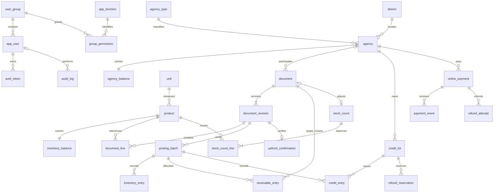

# Database DMS — thiết kế ERP/SME

## 1. Trạng thái và tài liệu

Đây là thiết kế PostgreSQL tham chiếu cho phạm vi ERP/SME đã được người dùng
chốt qua 15 câu hỏi. DDL có thể thực thi, gồm 29 bảng, các domain, index,
trigger toàn vẹn, view và hàm báo cáo. Transaction nghiệp vụ đầy đủ vẫn cần
được triển khai ở backend services; DDL không tự thực hiện việc giao hàng,
xác minh chữ ký cổng thanh toán hoặc gọi API hoàn tiền.

| File | Mục đích |
| --- | --- |
| [business_decision_making.md](business_decision_making.md) | Toàn bộ interview, phương án, **✅ lựa chọn**, quy ước bổ sung |
| [DMS.sql](DMS.sql) | Entry point psql; DDL PostgreSQL 16+ có version ở [0001_initial.sql](../../backend/alembic/sql/0001_initial.sql) |
| [DMS.dbml](DMS.dbml) | Bản DBML để dán vào dbdiagram.io; gồm 29 bảng, cột, khóa/quan hệ, CHECK và ghi chú phần chỉ có trong SQL |
| [seed.example.sql](seed.example.sql) | 20 quận mẫu, 3 đơn vị, 5 hàng mẫu; tùy chọn cho demo |
| [search-indexes.sql](search-indexes.sql) | GIN/pg_trgm cho tìm chứa chuỗi; tùy chọn |
| [verify.sql](verify.sql) | Kiểm tra hồi quy SQL, fixture rollback |
| [archive/DMS.legacy.sql](archive/DMS.legacy.sql) | Bảo toàn schema đầu vào để đối chiếu; không dùng triển khai |
| [DMS_exploration.md](../BA/DMS_exploration.md) | BA đầu vào; các thay đổi cần đồng bộ được liệt kê ở mục 9 |
| [CONTEXT.md](../../CONTEXT.md) | Thuật ngữ nghiệp vụ đã làm rõ |

Phạm vi: một doanh nghiệp, một kho; không nhà cung cấp/công nợ nhà cung cấp,
đa kho, đa tiền tệ hoặc sổ cái kế toán tổng hợp. Sổ kho, phải thu và dư có là
các **sổ phân hệ**, không được gọi là hệ thống kế toán kép hoàn chỉnh.

Để xem trên dbdiagram.io, tạo diagram mới và dán nội dung `DMS.dbml` vào editor
DBML. Domain, generated column, partial index, DEFERRABLE và trigger có ghi
chú trong file; dùng `DMS.sql` để triển khai database. Không dùng bản SQL export
từ sơ đồ thay cho các ràng buộc/routine của schema gốc.

## 2. Đáp ứng ba tiêu chí thiết kế

### 2.1. Tính đúng đắn

- Phân biệt **chứng từ**, **phiên bản**, **bằng chứng nhận/hoàn tiền**, **bút toán**.
- FK thực, CHECK trạng thái, khóa duy nhất, domain số chính xác; không dùng COMMENT thay ràng buộc.
- Chứng từ đã ghi nhận và ledger bất biến. Chỉnh nội dung bằng phiên bản mới;
  thay ledger bằng bút toán đảo + bút toán mới trong một transaction.
- Số dư phải thu, dư có và tồn không âm; kiểm tra lịch sử theo các mốc nghiệp vụ,
  không chỉ kiểm tra hiện tại. Kiểm tra theo phiếu phải thu và lô dư có còn
  mạnh hơn chỉ kiểm tra tổng đại lý: không dùng nợ phiếu khác che phiếu bị thu quá.
- Phiếu xuất + khoản thu tự sinh dùng cùng mốc để kiểm tra **kết quả atomic**,
  không từ chối vì trạng thái trung gian chưa trừ khoản trả ngay.
- Tổng tiền đối chiếu dòng; dòng theo giá/đơn vị snapshot; ledger đối chiếu
  phiên bản hiện hành; phiên bản cũ phải được đảo hết ảnh hưởng.
- Trả hàng là nghiệp vụ mới, không xóa giao dịch bán đúng; hoàn tiền chỉ ghi
  giảm dư có khi thật sự thành công.
- Callback/ghi sổ/refund có idempotency; tiền dư online không mất khỏi hệ thống.
- Audit tự động ghi thay đổi, bất biến; không sao chép password/token hash.

### 2.2. Tính tiến hóa

- Mã nội bộ số và mã nghiệp vụ tách biệt; đổi tên không ảnh hưởng FK.
- Số loại/mặt hàng/đơn vị là số record, không là tham số cần cập nhật thủ công.
- Quy định số đại lý/tỷ lệ dùng bảng có kiểu rõ ràng; hạn mức nằm ở loại đại lý.
- Danh mục có trạng thái ngừng dùng; FK RESTRICT bảo vệ các bản ghi đã được tham chiếu.
- Trạng thái dùng TEXT + CHECK có thể đổi bằng migration; không dùng enum native
  hoặc bảng EAV để né thiết kế thuộc tính nghiệp vụ.
- Chứng từ dùng một cấu trúc định danh/phiên bản chung với kind hữu hạn và
  kiểm tra theo từng loại, không dùng JSON làm chi tiết hàng hay quan hệ đa hình
  không có FK. Thêm loại mới cần bổ sung constraint, kiểm tra và service.
- Snapshot lưu điều kiện/giá tại lúc chốt; đổi quy định không viết lại phiếu cũ.
- Đơn vị đã phát sinh không thay bản chất. Quy đổi nhiều đơn vị/đa kho nếu thêm
  sau phải là migration và nghiệp vụ rõ ràng, không chỉ thêm cột tùy ý.

### 2.3. Truy vấn và dung lượng

- Danh mục tách chuẩn hóa; tiền không là float; không lưu dư nợ trên từng bản sao hồ sơ.
- Cache tồn/giá và số dư đại lý phục vụ tra cứu thường xuyên, được SQL cập nhật
  từ ledger. Không tổng hợp toàn bộ lịch sử mỗi lần mở danh sách đại lý/tồn.
- Giá bán hiện tại là tính toán rẻ từ giá nhập cache và một tỷ lệ: không lưu
  thêm cache phải cập nhật hàng loạt khi đổi tỷ lệ. Giá lịch sử vẫn lưu trên dòng.
- Mã hiển thị sinh từ identity, FK dùng integer/bigint thay vì VARCHAR mã phiếu.
- Index theo truy vấn ở mục 7; unique index đã phục vụ FK có cùng prefix không
  cần tạo index trùng. Partial index cho hàng chờ, token sống và trạng thái hoạt động.
- Generated amount và tổng header là phi chuẩn hóa có kiểm soát, giúp đọc/in
  phiếu và tổng hợp doanh số không phải join hàng triệu dòng mỗi lần.
- Không tạo bản sao báo cáo tháng, không lưu tỷ lệ doanh số hoặc phần nợ đầu/cuối
  thành dữ liệu gốc; truy vấn lại theo trạng thái/ledger đúng sau chỉnh hồi tố.
- Chỉ snapshot nội dung để tái in/giải thích chứng từ. Không lưu nguyên request,
  token, header gateway hoặc full bản ghi nhạy cảm vào audit/webhook.
- Chi phí lưu phiên bản/ledger đổi lại truy vết. Không sao chép cả danh mục theo
  từng tháng, không tạo bảng chatbot/history hội thoại ngoài yêu cầu.

**Trade-off có chủ đích:** kiểm tra lịch sử/FIFO có chi phí ghi lớn hơn CRUD
đơn giản. Bản tham chiếu ưu tiên tính đúng; constraint deferred có thể lặp kiểm
tra khi transaction nhiều dòng. Giao dịch mới ở mốc cuối kiểm tra số dư và
chứng từ nguồn; sửa/đảo/hồi tố mới replay các nguồn thanh toán của đại lý.
Không quảng cáo O(1) cho thao tác sửa hồi tố. Khi dữ liệu lớn, đo
profiling rồi bổ sung checkpoint/dirty-set hoặc gom kiểm tra một lần mỗi
đại lý/mặt hàng tại cổng ghi sổ; không bỏ kiểm tra lịch sử để tăng tốc.

## 3. Quy ước dữ liệu

### Khóa và thời gian

- PK danh mục nhỏ: INTEGER; tài khoản/đại lý/hàng/chứng từ/ledger: BIGINT identity.
- `DL-<id>`, `MH-<id>`, `PN-<id>`, `PX-<id>`… là mã sinh, không nhập tay, không
  tái sử dụng. Không yêu cầu số chứng từ liên tục; rollback có thể tạo khoảng trống.
- Mọi bảng có **`"createdAt"`, `"updatedAt"` TIMESTAMPTZ NOT NULL**. Trigger đặt
  hai giá trị bằng nhau khi insert, giữ createdAt và cập nhật updatedAt khi sửa.
  Ledger/audit bất biến nên hai cột giữ nguyên bằng nhau suốt vòng đời.
- `businessDate` là DATE cho kỳ báo cáo. `readyAt`, `postedAt`, `receivedAt`,
  `paymentTime`, `completedAt` là thời điểm sự kiện khác nhau.
- `businessOrder` sinh một lần khi ghi nhận ban đầu và giữ qua các phiên bản;
  phá hòa trong cùng ngày. Không lấy updatedAt làm thứ tự nghiệp vụ.
- Lưu instant UTC; lúc chuyển từ instant sang ngày Việt Nam dùng
  `(instant AT TIME ZONE 'Asia/Ho_Chi_Minh')::date`, không phụ thuộc timezone máy chạy.
- Tên bảng snake_case; tên cột nhiều từ camelCase có quote để giữ chính xác
  createdAt/updatedAt theo yêu cầu. ORM phải map tên SQL được quote tương ứng.

### Tiền và số lượng

| Domain | Giới hạn và tính chất |
| --- | --- |
| `money_vnd` | NUMERIC nguyên, trị tuyệt đối < 10^18; chặn phần lẻ, NaN/infinity |
| `quantity_value` | NUMERIC tối đa 3 số lẻ có nghĩa, trị tuyệt đối < 10^15; chặn NaN/infinity |
| `price_rate` | NUMERIC > 0, < 1000, tối đa 6 số lẻ có nghĩa |

Domain dùng NUMERIC không typmod rồi CHECK để **từ chối** đầu vào 1,5đ hoặc
1,0001 đơn vị, thay vì NUMERIC(18,0)/(18,3) âm thầm làm tròn. API cũng kiểm tra
Decimal và chuẩn hóa tiền thành số nguyên trước khi gửi SQL.

```text
giá xuất = round(giá nhập snapshot × tỷ lệ snapshot, 0)
thành tiền dòng = round(số lượng × giá xuất, 0)
tổng phiếu = tổng các thành tiền dòng đã làm tròn
```

PostgreSQL NUMERIC round: nửa đơn vị làm tròn ra xa 0; số tiền kinh doanh ở đây
không âm nên tương đương HALF_UP. Không tính tổng từ float phía trình duyệt.

**Trả từng phần:** không dùng phép làm tròn độc lập gây hoàn vượt tiền gốc.

```text
tiền lần trả này
 = round(tổng lượng đã trả gồm lần này × giá bán gốc, 0)
 − tổng tiền những lần trả trước
```

`returnAmount` là số dẫn xuất phục vụ trường hợp này. SQL kiểm tra lũy kế,
giá/đơn vị dòng gốc và lượng trả không vượt lượng bán. Dòng trả có thể 0đ do
làm tròn nhưng vẫn phải ghi nhận hàng thực tế; không tạo bút toán tiền 0.

## 4. Mô hình và danh sách 29 bảng



ERD giản lược; các liên kết origin, currentRevision, reversal và FK composite
được mô tả chính xác trong DDL. Có thể chưa có line khi đang nháp.

| Nhóm | Bảng | Dữ liệu chính/quan hệ |
| --- | --- | --- |
| RBAC | `user_group` | Code/tên nhóm; seed 4 nhóm, có thể thêm |
| RBAC | `app_function` | Code chức năng ổn định; seed quyền theo thao tác |
| RBAC | `app_user` | Email login unique không phân biệt hoa thường, passwordHash, groupId, status, authVersion |
| RBAC | `group_permission` | UNIQUE(groupId,functionId), isAllowed BOOLEAN |
| Auth | `auth_token` | Digest SHA-256 của token ngẫu nhiên, loại refresh/reset, hết hạn/thu hồi; không lưu token thô |
| Quy định | `business_rule` | Một record true: maxAgenciesPerDistrict, sellingPriceRate |
| Danh mục | `district` | Code/tên/trạng thái; số quận là số record |
| Danh mục | `agency_type` | Code/tên, maxDebt, trạng thái |
| Danh mục | `unit` | Code/tên, allowsFraction, trạng thái |
| Đại lý | `agency` | Hồ sơ, type/district FK, ngày nhận, ACTIVE/TERMINATED, người/lý do ngừng |
| Đại lý | `agency_balance` | Cache phải thu và dư có, 1:1 đại lý |
| Hàng | `product` | Tên, đơn vị FK, ngưỡng cảnh báo, trạng thái |
| Hàng | `inventory_balance` | Cache tồn, giá nhập hiện tại và dòng nguồn giá |
| Chứng từ | `document` | Kind, mã sinh, creationKey unique để retry tạo phiếu, đại lý không đổi, origin FK, currentRevision, status, thứ tự ban đầu, thông tin hủy |
| Chứng từ | `document_revision` | revisionNo, ngày nghiệp vụ, tổng, trả ngay, snapshot tỷ lệ/hạn mức/liên hệ, tác nhân và thời điểm chốt/xác nhận |
| Chứng từ | `document_line` | STT, product/unit FK + tên snapshot, quantity, unitPrice, giá nhập gốc, dòng trả gốc, generated amount |
| Trả ngay | `upfront_confirmation` | Xác nhận tiền thật gắn đúng phiên bản chờ xuất, số tiền/phương thức, kết quả gắn phiếu thu |
| Online | `online_payment` | Đại lý, provider/reference, idempotency, amount, trạng thái, thời hạn, thời điểm trả, receipt FK unique |
| Online | `payment_event` | Callback đã xác minh, eventKey unique theo payment; payload tối thiểu |
| Ghi sổ | `posting_batch` | POST/REVERSE/REALLOCATE gắn revision, idempotency; một POST mỗi revision |
| Kho | `inventory_entry` | Delta có dấu, line/product/unit FK, ngày/thứ tự hiệu lực, reversal unique |
| Phải thu | `receivable_entry` | Charge/payment/return/credit có dấu, nguồn batch và phiếu đích cùng đại lý; đồng thời là phân bổ thanh toán |
| Dư có | `credit_lot` | Lô dư có: nguồn revision và nguồn tiền phiếu thu cùng đại lý |
| Dư có | `credit_entry` | Tạo/hoàn/bù có dấu, FK lô, ngày/thứ tự hiệu lực, reversal unique |
| Refund | `refund_reservation` | Lô/số tiền dành cho refund đang chờ; ACTIVE/RELEASED/CONSUMED |
| Refund | `refund_attempt` | Yêu cầu API online, idempotency, provider proof, PENDING/UNKNOWN/SUCCESS/FAILED |
| Kiểm kê | `stock_count` | Ngày đếm, người lập/duyệt, trạng thái và chứng từ điều chỉnh |
| Kiểm kê | `stock_count_line` | Book/count/difference, product/unit, last-entry snapshot để phát hiện số liệu đã đổi |
| Audit | `audit_log` | Tác nhân/chức năng/thao tác, đối tượng, trước/sau, requestId và timestamp |

### Các loại chứng từ chung

| kind | Dòng hàng | Đại lý | Nguồn/liên kết | Ghi sổ |
| --- | --- | --- | --- | --- |
| STOCK_RECEIPT | Có, quantity > 0 | Không | — | Kho +q |
| STOCK_ISSUE | Có, quantity > 0 | Có | Phiếu thu tự sinh nếu trả ngay | Kho -q, phải thu +tổng |
| PAYMENT_RECEIPT | Không | Có | AUTO_FROM_ISSUE / DEBT_COLLECTION / RECEIVED_UNAPPLIED | Phải thu -phần phân bổ, dư có +phần dư được phép |
| STOCK_ADJUSTMENT | Có, delta có dấu, price 0 | Không | Có thể từ kiểm kê | Kho ±q, không doanh số |
| SALES_RETURN | Có, tham chiếu dòng bán và giá gốc | Có | Phiếu xuất gốc | Kho +q, giảm nợ phần chưa trả, tăng dư có phần đã trả |
| CREDIT_APPLICATION | Không | Có | Dùng lô dư có và FIFO phiếu đích | Phải thu -a, dư có -a, tiền thu mới 0 |
| REFUND | Không | Có | Phiếu thu nguồn, lô dư có, attempt nếu online | Dư có -a khi tiền thực sự đã trả |

Không tạo bảng PAYMENT_ALLOCATION trùng dữ liệu: `receivable_entry` đã có
source batch → receipt/credit revision, target invoice, amount và lịch sử đảo.
Một phiếu thu trả nhiều phiếu, một phiếu xuất nhận nhiều khoản thu.

## 5. Transaction bắt buộc ở business services

Ràng buộc deferred được kiểm tra ở COMMIT. Backend không được gửi HTTP thành
công trước khi commit thành công. Trước khi trả số dư mới, gọi
`SET CONSTRAINTS ALL IMMEDIATE`; sau đó đọc cache, commit, rồi trả response.
Cache chưa được refresh giữa các INSERT khi constraint còn deferred.

### 5.1. Giao thức ghi chung

1. Xác thực người dùng/quyền API, không chỉ ẩn menu. Đặt transaction-local
   `set_config('dms.actor_id', user_id, true)` và `dms.request_id`; webhook/worker
   là SYSTEM, lưu bằng chứng xác minh ở payment_event/refund_attempt. Đặt
   `dms.function_code` theo chức năng đã được xác thực (ví dụ stock.issue.post,
   documents.cancel) để audit cùng transaction mang đúng ý định thao tác;
   nếu không đặt, trigger dùng mã mặc định của bảng cho script/bootstrap.
2. Khóa dữ liệu dùng chung theo thứ tự nhất quán: rule/type khi cần; agency
   balance (theo id); inventory balance (theo productId); documents nguồn/đích
   (theo id); credit lots (theo id); payment/refund records. Khi sửa hồ sơ cũng
   khóa agency/balance trước khi đọc số dư để đổi loại/ngừng hợp tác.
3. Đọc lại trạng thái hiện hành dưới khóa; tính Decimal, ngày và các dòng liên quan.
4. Chốt revision, status/currentRevision/order; tạo batch idempotent; append
   ledger và thông tin liên kết trong cùng transaction.
5. Khi sửa/hủy hồi tố, đảo **mọi ảnh hưởng còn hiệu lực** của version cũ. Chỉ
   đảo entry nguyên bản chưa được đảo; không đảo một reversal. Batch REVERSE
   gắn revision cũ; batch POST gắn revision mới; REALLOCATE gắn source receipt
   hiện hành. Đảo giữ đúng date/order/key và đối dấu giá trị.
6. Replay FIFO và return split từ mốc bị ảnh hưởng, cập nhật cả các nguồn sau
   đó có phân bổ thay đổi. Không chỉ sửa tổng dư nợ hoặc một receipt đầu tiên.
7. Force constraints, đọc cache, commit. UNIQUE/idempotency retry trả kết quả
   cũ; deadlock/serialization retry toàn transaction với cùng business key.

Không giữ transaction/row lock trong lúc người dùng nhập phiếu hoặc chờ API
cổng thanh toán. Transaction chỉ bao quanh bước dữ liệu ngắn.

### 5.2. Nhập và xuất

- Nhập: DRAFT → POSTED, ít nhất một dòng, master/unit đang dùng; append kho +q.
- Xuất: DRAFT → READY (document PENDING), chốt giá/nguồn/tỷ lệ/hạn mức và liên hệ;
  nếu sửa nội dung chờ tạo revision mới, xác nhận trả ngay lại theo phiên bản đó.
- READY → POSTED: kiểm tra lại master/agency, tổng lượng và hạn mức hiện tại;
  không đổi giá đã chốt. Chưa dành tồn cho phiếu chờ, nên có thể bị từ chối
  tại bước thực xuất nếu người khác đã sử dụng tồn.
- Nếu trả ngay > 0, cần upfront_confirmation; tạo/ghi phiếu thu tự sinh trong
  cùng transaction. Receivable của issue và auto receipt có cùng date/order.
- Tiền trước xuất đã nhận nhưng xuất thất bại: giữ bằng chứng VERIFIED, xử lý
  bằng receipt RECEIVED_UNAPPLIED và state RECEIVED_SEPARATELY; FIFO phần có
  thể trả nợ, phần dư thành credit. Dashboard phải hiển thị khoản VERIFIED
  chưa gắn receipt, tránh bỏ sót tiền nhận đang chờ.
- Sau khi đã ghi nhận, số tiền trả ngay thực nhận là bất biến khi sửa phiếu.
  Sửa số lượng/giá hợp lệ giữ chứng từ tiền gốc; thay đổi tiền thực tế là thu
  thêm/refund/bù. Hủy giao dịch ghi sai mà tiền thực tế vẫn đã nhận phải chuyển
  bằng chứng sang receipt riêng, không làm biến mất tiền.

### 5.3. Thu tiền/FIFO

Thu công nợ thủ công > 0 và không vượt nợ **tại ngày nghiệp vụ** có thể phân
bổ. SQL chặn thu vào tương lai, chặn overpay và kiểm tra FIFO. Thu được cho
đại lý ngừng hợp tác. Không dùng phần dư có để coi là tiền mặt/chuyển khoản.

Online: TX1 tạo PENDING với tiền ≤ nợ hiện tại và merchant key; gọi cổng sau
commit. Callback xác minh provider/reference/amount/signature, giữ payment và
agency dưới khóa; TX2 ghi event SUCCESS, receipt đầy đủ, FIFO phần nợ và credit
phần dư. Local hết hạn không được phủ nhận verified late success; SUCCESS
bất biến. Không receipt/nợ thay đổi cho FAILED/EXPIRED.

### 5.4. Trả hàng, bù và refund

- Trả hàng: nhận toàn bộ/một phần, dùng giá bán gốc, cumulative rounding.
  `t = giá trị trả`, `u = nợ phiếu ngay trước trả`:
  giảm phải thu `min(t,u)`; dư có `max(t-u,0)`; kho tăng lượng thực nhận.
- Service xác định các nguồn tiền đã thanh toán phiếu và chia lô dư có theo
  nguồn đó, kể cả nguồn bù trước đây. FK đảm bảo cùng đại lý/phiếu thu; việc
  chọn đúng chuỗi provenance của khoản đã trả là trách nhiệm service.
- Bù: kế toán chọn số tiền ≤ credit khả dụng và ≤ công nợ hợp lệ; tiêu lô credit,
  FIFO invoice. Không thêm PAYMENT_RECEIPT vì không có cash mới.
- Refund: một chứng từ liên kết một receipt nguồn; nhiều nguồn dùng nhiều
  chứng từ. Tổng đã hoàn + đang dành không vượt tiền receipt nguồn.
- Online refund: TX1 reserve lô credit, tạo attempt PENDING, commit; gọi provider
  với idempotency. SUCCESS: TX2 post refund, debit credit, consume reservation
  cùng transaction. Failure đã chắc chắn: đánh FAILED và release. Timeout/
  kết quả chưa biết: UNKNOWN, **giữ reservation**, query trạng thái trước retry.
- Cash/bank refund: xác minh tiền thật đã trả rồi post; nếu có bước chờ thì
  cũng reserve trước. Refund đã trả không được hủy để giả tiền chưa từng ra.

### 5.5. Kiểm kê

Lưu cả dòng có chênh lệch 0. Capture bookQuantity + last-entry id, nhập số đếm.
Lúc xác nhận kiểm tra không có biến động từ snapshot; nếu có, đối chiếu/đếm
lại. Chênh lệch khác 0 cần adjustment có lý do, dòng đúng difference, ghi sổ
trong cùng transaction. Chênh lệch 0 không tạo adjustment rỗng. Bằng chứng
kiểm kê đã xác nhận bất biến; muốn điều chỉnh tiếp dùng chứng từ mới.

## 6. Phân chia trách nhiệm SQL và backend

| Quy tắc | Database thực thi | Backend cần thực hiện |
| --- | --- | --- |
| Domain/status/FK/unique | CHECK, domain, FK composite, unique index | Thông báo lỗi dễ hiểu, validate sớm |
| Giá/số lượng/tổng/snapshot | Generated, trigger theo kind, đối chiếu total | Capture master/contact, Decimal trước submit |
| Mã/đại lý không đổi, version bất biến | Guard document/revision/line | Tạo revision mới và workflow xác nhận |
| Tồn/nợ/dư có không âm lịch sử | Deferred ledger checks | Lập đúng bút toán và replay các nguồn phụ thuộc |
| FIFO, split return, hiệu lực source | SQL kiểm tra phân bổ/kết quả nguồn | Thuật toán tạo/replay phân bổ |
| Limit/capacity/type mới | SQL guard + lock + final debt | Lock theo protocol, báo các đại lý gây chặn |
| Online một receipt, refund/provenance/reservation | FK, CHECK, unique, deferred reconciliation | Xác minh provider, ký/kiểm callback, gọi/query API |
| Audit bất biến, bỏ hash | Trigger tự ghi, chống UPDATE/DELETE | Đặt actor/request đúng và quyền chức năng |
| Email login unique, authVersion | Unique lower(email), auto bump | Argon2id/hash, kiểm locked/version, revoke token và RBAC |
| Chatbot | Read models và bảng quyền | Chỉ công cụ read có whitelist, kiểm quyền giống API, chọn đại lý theo mã |

Trigger là lớp bảo toàn dữ liệu, không thay xác thực người dùng. Tài khoản DB
owner có quyền quản trị; runtime nên dùng non-owner login có grants rõ ràng.
Do internal trigger gọi các hàm assert, runtime cần EXECUTE các hàm liên quan
cùng DML cần thiết; không cấp DDL/TRUNCATE, không cho trình duyệt truy cập DB.
Read-only reporting role chỉ được SELECT phù hợp và EXECUTE sales/debt_report.

## 7. Truy vấn, index và phân trang

| Nhu cầu | Index/read model |
| --- | --- |
| Mã chính xác | Unique agency/product/document code |
| Loại/quận/đại lý đang dùng | agency type/district + partial active district |
| Tên prefix, phone | lower(name) text_pattern_ops, phone B-tree |
| Tên chứa chuỗi | search-indexes.sql GIN pg_trgm; lọc >= 3 ký tự có ích nhất |
| Kho hiện tại/giá bán | inventory_overview + product/balance PK |
| Kho/nợ lịch sử | owner, businessDate, businessOrder index |
| Nợ trong khoảng | agency_balance(currentDebt,agencyId) |
| Hàng chờ xử lý | document(kind,status,id) partial |
| Phiếu trong khoảng ngày | posted revision(businessDate,documentId) + current revision unique |
| Detail và phiên bản | Unique(documentId,revisionNo), unique(revisionId,lineNo/productId) |
| Callback/refund retry | Merchant/idempotency/provider reference unique, pending index |
| Audit | Time/id, actor/time, entity/key/id |

Ví dụ keyset pagination (không bọc tùy ý mọi điều kiện trong `OR :param IS NULL`):

```sql
SELECT * FROM dms.agency_overview
WHERE id > :last_id AND "districtId" = :district_id
ORDER BY id LIMIT :page_size;

SELECT * FROM dms.current_document
WHERE status = 'POSTED' AND kind = 'STOCK_ISSUE'
  AND "businessDate" >= :from_date AND "businessDate" < :to_date
  AND ("businessDate", id) > (:last_date, :last_id)
ORDER BY "businessDate", id LIMIT :page_size;

SELECT * FROM dms.sales_report(DATE '2026-06-01', DATE '2026-07-01');
SELECT * FROM dms.debt_report(DATE '2026-06-01', DATE '2026-07-01');
```

Dùng khoảng nửa mở `[đầu tháng, đầu tháng sau)`, không EXTRACT(month/year) trên
cột lọc làm mất khả năng dùng range index. Parameters phải được bind, tên
sort/filter có whitelist. Đếm phiếu từ header hiện hành, không join detail rồi
COUNT(*) gây nhân số phiếu.

### Ý nghĩa báo cáo

- BM6.1: gross sales, số phiếu xuất, tỷ lệ trên tổng gross; thêm returns/net
  riêng. Đại lý chỉ có trả hàng cũng xuất hiện với 0 phiếu xuất và net âm.
  Nếu tổng gross 0, tỷ lệ 0; không chia tỷ lệ theo net có thể âm.
- BM6.2: tăng là charge; giảm tách cash applied, returns applied, credit applied.
  `closing = opening + increase - decreases`. Phần tiền thu thành dư có không
  giảm nợ, phải xuất ở báo cáo dư có/thu tiền riêng.
- `remainingAtIssue` là BM3 remainder lúc xuất; `invoice_balance.outstandingAmount`
  là nợ hiện tại. SETTLED nghĩa nghĩa vụ đã tất toán, có thể bằng tiền/bù/trả
  hàng, không tự kết luận toàn bộ giá trị là tiền thực thu.
- Tiền thực thu: tổng current PAYMENT_RECEIPT POSTED, không cộng CREDIT_APPLICATION.
  Khoản upfront VERIFIED chưa có receipt trình bày riêng để không bỏ sót hoặc
  đếm hai lần. Tiền hoàn là current REFUND POSTED, không là SALES_RETURN.
- Nhập–xuất–tồn/thẻ kho tổng hợp inventory_entry theo ngày; đảo nguyên bản giữ
  date/order nên chỉnh hồi tố không bị ghi sai là lượt nhập/xuất tháng sửa.
- `EXPLAIN (ANALYZE, BUFFERS)` trên data đại diện mới kết luận hiệu năng; bộ
  smoke test không chứng minh SLA, phân trang triệu bản ghi hay concurrency.

## 8. Tiến hóa, lưu trữ và migration

29 bảng là phạm vi chức năng đã chọn, không phải tạo 29 module enterprise.
Không phân vùng sớm. Khi audit/ledger rất lớn, có thể BRIN theo thời gian và
partition; phải xử lý PK/unique/FK/self-reversal trước khi chuyển partition.
Không thêm GIN mọi cột JSONB: chưa có truy vấn justify chi phí ghi/dung lượng.

Không xóa/TTL ledger, audit, version hoặc payment evidence đang là nguồn nghiệp
vụ. Token hết hạn có thể purge theo chính sách; audit không lưu token/password.
Snapshot được lưu ở revision, không nhân metadata người dùng trong mọi entry.

Nâng cấp bằng Alembic reviewed migrations, không chạy lại DMS.sql lên schema
đã tồn tại. Backend có migration `0001` cho đầy đủ object và `0002` cho search
index; ORM models cho business API chưa được map. Xem lại autogenerate vì
Alembic không tự hiểu mọi domain/routine. DDL snapshot đã triển khai không
được sửa; thay đổi schema phải tạo revision mới.
Nếu có dữ liệu legacy, lập migration riêng: chuẩn hóa dialect/status, map mã
cũ → PK mới, tạo version/batch/ledger mở đầu từ chứng từ thực, đối chiếu stock,
debt, credit, totals trước cutover. Không coi cached debt/stock cũ là nguồn duy
nhất để dựng lại lịch sử.

## 9. Độ phủ BA và thay đổi phải đồng bộ

| BM/QĐ | Cách đáp ứng / bổ sung |
| --- | --- |
| 1 | agency/type/district; cap active, duplicate name, không mở lại terminated, thu nợ vẫn được |
| 2 | STOCK_RECEIPT + version/line; draft/post, giá mới nhất theo ngày nghiệp vụ |
| 3 | STOCK_ISSUE, snapshot giá/tỷ lệ, READY, upfront + auto receipt atomic |
| 4 | agency_overview và indexes; không gộp đại lý theo tên |
| 5 | PAYMENT_RECEIPT và receivable allocations; bổ sung ngoại lệ tiền online thực nhận vượt nợ |
| 6 | sales_report/debt_report; tính lại kỳ gốc khi sửa; mở rộng cột return/credit/net |
| 7 | business_rule + agency_type; audit; chặn hạ limit/capacity dưới hiện trạng |
| 8 | Loại active/inactive, FK ngăn xóa đang tham chiếu |
| 9 | product/unit active, unit policy, snapshot, không lưu nhóm hàng ngoài BA |
| 10 | Giữ phiên bản, ledger đảo, lý do, atomic replay; phân biệt tiền thật/return/refund |
| 11 | app_user, email CI unique, passwordHash, status/authVersion/token |
| 12 | user_group, bốn seed groups, FK ngăn xóa nhóm có user |
| 13 | app_function + group_permission; quyền chi tiết chuẩn bị/xác nhận/điều chỉnh |
| 14 | audit tự động trước/sau, actor/request, append-only; không lộ hash |
| 15 | online_payment + verified events; idempotency, success receipt, excess credit, refund attempts |
| 16 | Chỉ read có quyền; read models; tên trùng trả mã–tên–quận; không lưu hội thoại bắt buộc |
| Phần mở rộng | stock_count/adjustment, FIFO allocations, return, credit, refund và quy trình trách nhiệm |

BA cần cập nhật đặc biệt: thêm nháp/chờ/xác nhận; mốc chốt giá; quy tắc phân
bổ; phạm vi sửa sai so với trả hàng thực; dư có và refund; BM6 giảm nợ không
chỉ là tiền mới thu; snapshot lịch sử; một mặt hàng một dòng; hạn chế đổi
đơn vị và khoản trả ngay thực nhận. Các thay đổi này được ghi minh bạch trong
business_decision_making, không âm thầm diễn giải schema là y hệt 17 bảng cũ.

## 10. Chạy và kiểm chứng

**Triển khai backend/Supabase bằng Alembic**, từ `backend/`:

```sh
uv sync --frozen
uv run alembic upgrade head
uv run python -m app.db.seed
uv run python -m app.db.verify --seeded --regression
```

DDL đầy đủ và search indexes là snapshot trong `backend/alembic/sql/` để
revision luôn tự chứa, kể cả trong Docker. `DMS.sql`, `search-indexes.sql` và
`verify.sql` ở thư mục này là entry point psql dùng `\ir` trỏ tới các file đó
và bộ regression trong backend. Bộ seed đầy đủ ở `backend/app/db/seed.py`;
[README root](../../README.md#database-và-dữ-liệu-demo) có độ phủ và tài khoản mẫu.

Để thực thi tham chiếu độc lập bằng psql, từ `openwiki/database-design/`,
với PostgreSQL trống và connection được cấu
hình qua các biến PG* hoặc service của psql:

```sh
psql -v ON_ERROR_STOP=1 -f DMS.sql
psql -v ON_ERROR_STOP=1 -f search-indexes.sql   # optional substring search
psql -v ON_ERROR_STOP=1 -f seed.example.sql    # optional demo, fresh schema
psql -v ON_ERROR_STOP=1 -f verify.sql          # expects demo seed; all fixtures rollback
```

DMS.sql tạo schema `dms` trong một transaction; thất bại nếu schema đã có để
không ghi đè dữ liệu. Không tự chạy migrations lúc API startup. Không chứa
credential hoặc tài khoản/mật khẩu mặc định. Seed core chỉ gồm quy định, hai
loại và bốn nhóm/quyền; tên quận/hàng/đơn vị demo không phải dữ liệu BA chính thức.

**Kiểm chứng thực hiện trong phiên này:** PostgreSQL 18.3 qua PGlite 0.5.8,
thực thi DMS.sql, extension search indexes, seed và verify.sql; 29/29 bảng có
hai timestamp, 54 assertions/expected rejections qua. Bài kiểm tra bao gồm
precision/NaN, capacity, hạn mức, version bất biến, FIFO, cross-agency,
online excess/idempotency, return, bù, refund reservation/success, kỳ báo cáo,
upfront atomic/fallback tiền đã nhận, làm tròn trả từng phần, tái phân bổ khi
hủy phiếu, đơn vị lịch sử, kiểm kê không chênh lệch và chỉnh kho/nợ làm âm
lịch sử dù hiện tại hợp lệ.

**Kiểm chứng bổ sung trên Supabase PostgreSQL 17.6:** Alembic lên revision `0002`,
seed đủ 29 bảng (410 chứng từ, 30 đại lý, 24 hàng, 8 tài khoản), đối chiếu
ledger/cache/audit/report và 54 kiểm tra SQL trong schema riêng rollback.
Tài khoản app được hash Argon2id, không phải Supabase Auth users.

Chưa gọi cổng sandbox, chưa stress-test nhiều session hoặc đo
hiệu năng dữ liệu lớn. PGlite chạy PostgreSQL thực nhưng không thay những
kiểm chứng tích hợp này. Các business services/API/auth hiện vẫn là bước triển
khai tiếp theo của repository.
