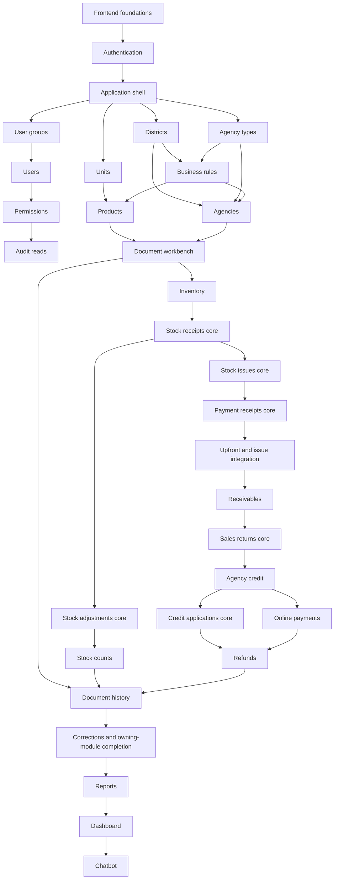

# General Plan

**Frontend implementation order, module dependencies, API integration contract,
and completion gates**

**Updated:** 2026-10-01. **Current next module:** `frontend_foundations`.
**Status:** roadmap only; the UI currently has a health-check starter page.
**Scope of this document:** general planning contract. Detailed child-module plans
will be prepared when requested; none are created by this roadmap.

## 1. Where to start

Build the shared frontend/API/test foundations first, then authentication and the
permission-aware application shell. Follow with administration, master data,
document and settlement workflows, and finally reports/dashboard/chatbot.

```text
Existing React / TypeScript / Vite starter
  -> Frontend foundations: API contract, routing seam, common states and tests
  -> Authentication + permission-aware application shell
  -> Account/group/permission administration + audit browsing
  -> Master data and dealer management
  -> Document workbench + inventory + receipts/issues/cash/upfront integration
  -> Counts + returns + credit + online payments + refunds
  -> Full document history/printing + posted-document corrections
  -> Reports + dashboard + chatbot
```

This is the recommended delivery order. The frontend prerequisite column in §4
contains direct dependencies; earlier dependencies are inherited transitively.
Backend prerequisites identify the owning implementation slices in the
[backend General Plan](../backend-design/GENERAL_PLAN.md). They mean the relevant
operations and test gates must actually pass, not merely have a plan file.

A frontend feature can be developed against source-derived fixtures before its
backend exists. That is a contract-mocked slice, not completed live integration.
Business routes must remain clearly unavailable until their needed backend
operations are implemented. A failed health request must not switch a live app
silently into demo data or imply that simulated money was really received.

## 2. Sources and existing baseline

| Source | Authority / role |
| --- | --- |
| [BA requirements](../BA/DMS_exploration.md) | BM/QĐ, user-facing workflows and account/group/function/audit requirements. |
| [Database design](../database-design/README.md) and [business decisions](../database-design/business_decision_making.md) | Selected draft/confirmation/version/FIFO/return/credit/refund behavior; persisted states and historical meaning. |
| [Backend API contract](../backend-design/API/openapi.json) | HTTP methods, operation IDs, JSON schemas, permissions, headers, status codes and content negotiation. |
| [Backend General Plan](../backend-design/GENERAL_PLAN.md) | API implementation order, prerequisite slices and deferred correction/money integrations. |
| [Backend authentication design](../backend-design/plan/authentication/DESIGN.md) | Proposed JWT/refresh/reset lifecycle and reset-link fragment; planned work, not implemented HTTP auth. |
| [UI guidance](../../ui/AGENTS.md), [UI README](../../ui/README.md), [verification workflow](../../.agents/workflows/verify.md) | Current stack, structure, environment and checks. |

Keep **one HTTP contract**: reference the backend OpenAPI rather than copying it
into frontend-design and letting two specifications diverge. Frontend module
plans later map their screens/actions to source operation IDs and actual runtime
availability. UI routes are browser routes and do not redefine API paths.

Current UI: React 19, strict TypeScript, Vite, native fetch/AbortController, plain
CSS, ESLint/Prettier, npm lockfile, `src/app/App.tsx` and `src/lib/api.ts`. The
starter checks liveness and links to API docs. There is no client-side router,
session store, feature directory, component test runner or browser-test framework.
The backend has reviewed SQL/schema/seed infrastructure; business HTTP endpoints
and auth remain future work. Liveness does not prove database/API-feature readiness.

Preserve the existing setup and cancellation/StrictMode behavior as foundations
are added. Choose new routing/validation/test dependencies in the owning detailed
plan; update package.json/package-lock.json together and verify `npm ci`. This
roadmap does not install libraries, create screens or implement backend services.

## 3. Shared frontend integration contract

### 3.1. Ownership and structure

- Application composition, routes, layouts and providers: `ui/src/app/`.
- Shared transport, schema validation, session coordination and reusable formatting:
  `ui/src/lib/` (promote feature helpers only when actually reused).
- Screens, hooks, forms, feature API adapters and types: `ui/src/features/<feature>/`.
- Shared visual primitives belong in one documented shared location chosen in
  frontend_foundations; avoid copying tables/dialogs/error states into each feature.
- Test files colocate with features or follow the owning plan's consistent layout;
  browser tests have a dedicated directory chosen in the foundations plan.

Route/page components compose feature behavior; the shared client handles transport
and common errors. Domain state/permissions/actions remain in the owning feature.
The frontend never calls PostgreSQL/Supabase directly and never computes its own
authoritative inventory, debt, posted totals, payment verification or FIFO allocation.

### 3.2. Requests, validation and numeric/time semantics

- Use configured `VITE_API_BASE_URL` (default `/api/v1`); it is public, build-time
  configuration. No database, signing, SMTP or provider secret goes into `VITE_*`.
- Use source request/response schemas and runtime validation at the API boundary;
  TypeScript interfaces alone do not validate remote JSON. Any generated types
  remain synchronized with the source contract; don't hand-maintain a second API.
- Preserve camelCase keys and decimal-string bigint IDs/money/quantities/rates.
  Do not convert monetary values or bigint identifiers through JavaScript Number.
  Validate/format without losing precision; input text and request strings remain
  distinct from localized display. Totals shown as previews are not commit results.
- Preserve password bytes and the source nonempty-password policy: no trimming,
  hidden length/composition requirement or client-side password normalization.
- Keep DATE business values as calendar-date strings; UTC instants display in
  Asia/Ho_Chi_Minh where specified. Do not derive dates using the user's host
  timezone or overwrite a historical snapshot with current catalogue/profile data.
- Bind list state to validated filters/sort/cursor. Changing filters resets cursors;
  respect API limit/defaults and half-open date ranges. Do not invent offset pages,
  unrestricted sort fields, ownership filters or duplicate-name aggregation.
- Abort stale reads on navigation/filter change, distinguish timeout vs user abort,
  and prevent an old response from overwriting new filter/account state.

### 3.3. Sessions and permissions

Authentication covers all seven source operations: login, refresh, logout, me,
self-password change, reset-email request and token reset completion. The detailed
authentication child plan must settle token storage/reload/multi-tab behavior,
refresh coordination and reauthentication UX before implementation. Access JWTs
are used only in Authorization headers; do not redesign the backend contract as
cookie auth or put session tokens in browser URLs/logs.

Use current `/auth/me` allowedFunctions for menus, route guards and action states.
AllOf/anyOf, kind-dependent document permissions and conditional count/cancel actions
must match the source. Never grant an unconditional MANAGEMENT bypass or infer a
dealer's owning employee. The backend remains the authorization authority.

Coordinate concurrent 401 refresh attempts through a single in-flight refresh per
session; account for the backend's single-use refresh tokens and consumed-ancestor
logout. Do not retry login/reset/change-password or arbitrary mutations with a
generic fetch retry. Wrong-current-password 401 is a field/domain failure, not a
reason to keep refreshing. Session invalidation, account locking and permission
denial have distinct UI outcomes; 403 permission denial is not an auth-refresh loop.

After logout/password change/reset/identity switch, clear account-scoped cached
data and pending authenticated reads; late responses must not repopulate it.
Check grants again after profile/session reload and handle server-side permission
changes even when a button was visible earlier. Deep links cannot bypass guards.

Reset requests always show the same accepted message for valid emails regardless
of existence/lock status. The backend's proposed reset URL carries token in the
fragment; the child auth plan must align with that design, clear the fragment from
history before rendering third-party content, and submit token only to the reset
operation. Successful password change/reset leads to login, not automatic unlock.

### 3.4. Concurrency, retries, state and errors

- Keep server ETag with the displayed resource. Updates/actions send source
  If-Match; permission creation uses If-None-Match where specified. Document-line
  operations and count-line edits use the **parent** ETag and update parent state.
- 412 prompts reload/review without silently overwriting another user's work;
  428 means the client must obtain the version. Preserve entered work where valid.
- Generate an idempotency key per user intent, preserve it across uncertain retries,
  and use a new intent/key when payload changes. Do not silently retry an uncertain
  money action with a new key or treat a transport timeout as confirmed failure.
- Prevent duplicate submits locally, but still rely on backend idempotency/locks.
  For pending provider outcomes, display/poll/reconcile the existing resource;
  never turn a browser redirect, checkout completion screen or optimistic update
  into SUCCESS. UNKNOWN refund keeps money reserved and disallows a new attempt.
- Show explicit idle/loading/empty/partial/success/validation/conflict/forbidden/
  unavailable states; keep errors actionable. Use safe source fieldErrors and
  requestId, handle 429 Retry-After and recoverable network failure without leaking
  secrets/raw response dumps. A 204 response is empty, not JSON to parse.
- Mutations refresh affected authoritative detail/list/balance/history/permission
  reads according to a shared invalidation contract. Do not optimistically change
  stock/debt/cash/credit or show committed success before the server confirms it.

### 3.5. User experience and accessibility contract

Build one coherent business interface in plain CSS unless a later requested plan
explicitly justifies a dependency change. Foundations define tokens, typography,
spacing, navigation, form/table/detail/dialog patterns and responsive behavior.
Business copy/labels should consistently follow the Vietnamese BA terminology;
exact layout and visual decisions belong to later child-module work.

Use semantic headings/labels/tables, keyboard-operable actions, visible focus,
focus-managed dialogs, status announcements and errors associated with inputs.
Differentiate current vs historical snapshot, draft vs READY/POSTED/canceled,
debt vs credit vs reserved/available, original remainder vs outstanding, and money
declared vs verified vs receipted. Status is communicated in text, not color alone.
Reasons/confirmation screens reflect source actions and permissions; a UI approval
never replaces the backend's business or payment-evidence validation.

## 4. Ordered frontend implementation map

`Fxx` identifies a frontend delivery slice. The module column is a **future** child
plan folder name, not a newly created directory. `Mxx` refers to backend roadmap
slices. The operation inventory for each child plan is prepared only when requested.

### Wave A — Foundations, access and administration

| Step | Module / slice | Screen/action contract | Frontend prerequisites | Backend integration gate |
| --- | --- | --- | --- | --- |
| F01 | `frontend_foundations` | Shared API client/schema-validation seam, route/test scaffolding, exact formatters, accessible primitives, loading/error/empty states and filter/precondition/idempotency conventions. | Existing UI starter | Source OpenAPI; current health endpoints; later business transport capabilities integrate with M02. Foundations can be implemented offline first. |
| F02 | `authentication` | Authentication: login/logout/current profile, refresh lifecycle, password change, reset request/completion and re-login states. | F01 | M01: all seven auth operations; backend reset-link design and actual mail/config availability. |
| F03 | `application_shell` | Permission-aware navigation/deep links, protected layouts, page error boundaries, denied/not-found/session-expired states and account-scoped cache cleanup. | F02 | M01 me/live grants; M02 safe common errors/headers for business requests. Dashboard content is not required for a usable shell. |
| F04 | `user_groups` | User Groups: list/search/detail/create/edit/delete and referenced-user conflict display. | F03 | M03; deletion eligibility and atomic grant cleanup verified. |
| F05 | `users` | Users: account search/create/edit, group selector, lock/unlock and admin password reset. | F04 | M04; case-insensitive email errors, ETags, session invalidation and safe password inputs. |
| F06 | `permissions` | Permissions: registry/grant matrix, create/update/revoke grant and concurrent-edit recovery. | F05 | M05; If-None-Match vs If-Match, exact allOf/anyOf and next-request grant changes. |
| F07 | `audit_logs` | Audit Logs: authorized filter/list/detail of actor/function/request and safe before/after data. | F06 | M06; immutable read-only audit API; no edit/delete controls. |

The auth/shell reads already-seeded grants; it does not wait for permission
administration screens. F01↔F02 implementation refines the shared client incrementally,
but prerequisites stay one-way: F01 supplies interfaces, F02 supplies session logic.

### Wave B — Master data and dealers

| Step | Module / slice | Screen/action contract | Frontend prerequisites | Backend integration gate |
| --- | --- | --- | --- | --- |
| F08 | `districts` | Districts: list/detail/create/edit/inactivate/delete with active capacity and safe conflict states. | F03 | M07; capacity is supplied by business rules, no client-only enforcement. |
| F09 | `agency_types` | Agency Types: list/detail/edit limits/state/delete; display blocking agencies on invalid lower limits. | F03 | M08; credit-limit/current-debt and reference guards. |
| F10 | `units` | Units: list/detail/create/edit/state/delete, fraction policy and used-unit restrictions. | F03 | M09; recorded-unit constraints. |
| F11 | `business_rules` | Business Rules: singleton display/edit, capacity/rate inputs, ETag conflicts and blockers. | F08, F09 | M10; exact Decimal validation and historical snapshot preservation. |
| F12 | `products` | Products: search/detail/create/edit/state/delete, unit selection, thresholds, current stock and server-calculated prices. | F10, F11 | M11; no editable authoritative stock/prices, active-unit and historical-unit restrictions. |
| F13 | `agencies` | Agencies: search/detail/create/edit/change type/district/delete/terminate, balances, duplicate-name disambiguation and termination reason. | F08, F09, F11 | M12; active capacity/current debt/earliest business date; TERMINATED has no reopen action. |

F08/F09/F10 can proceed independently after F03. Dealer/product forms are distinct
from later financial/inventory views; use permissions of the exact endpoint rather
than assuming a read permission also grants profile editing or master-data access.

### Wave C — Shared workbench and goods/cash workflows

| Step | Module / slice | Screen/action contract | Frontend prerequisites | Backend integration gate |
| --- | --- | --- | --- | --- |
| F14 | `document_workbench` | Shared draft header/line editor, kind dispatch, reason/confirmation patterns, snapshots, preview-vs-posted totals, parent ETags and stable user-intent keys. | F12, F13 | M13 plus each owning kind's implemented handlers; do not offer arbitrary generic posting or financial goods lines. |
| F15 | `inventory` | Inventory: current-stock entry points and product ledger/stock statement, date/effective-entry filters and opening balance. | F14 | M14; inventory.read; current product overview stays in products. |
| F16 | `stock_receipts` — core | Stock Receipts: list/detail/create/draft header and line editing/post/draft cancel; posted snapshot states. | F15 | M15 and receipt-kind M13 lines; posted correction/cancel waits for F29/M29. |
| F17 | `stock_issues` — core | Stock Issues: list/detail/draft editing/submit/READY snapshot/zero-upfront post; pending replacement without received money; draft cancellation. | F16 | M17; READY price preserved, stock/current limit rechecked at post; money-dependent completion waits for F19/M19. |
| F18 | `payment_receipts` — core | Payment Receipts: list/detail/manual debt receipt draft/edit/post/draft cancel; FIFO allocation and authoritative paid/debt results. | F17 | M18; no manual invoice allocation or edit of automatic/online receipts; posted correction/cancel waits for F29/M29. |
| F19 | `upfront_payments` + stock-issue integration | Upfront Payments: verification list/detail, record real-money evidence, receive separately, consume through issue posting, pending revision replacement after separation. | F18 | M19; VERIFIED is not a receipt; issue/automatic receipt atomic; failed stock post does not discard already received money. |
| F20 | `receivables` | Receivables: financial overview, agency balance, invoice outstanding/settlement, statement and source allocations. | F19 | M20; same `/agencies/{agencyId}/balance` resource shared with Agency Credit, not duplicated. |

The frontend mirrors backend staged delivery: issue drafts/zero-upfront can work
first, then receipt/upfront integration. A stock_issues or payment_receipts core
slice is not a completed child module while F19/F29 gates remain deferred.

### Wave D — Counts, returns, credit and provider workflows

| Step | Module / slice | Screen/action contract | Frontend prerequisites | Backend integration gate |
| --- | --- | --- | --- | --- |
| F21 | `stock_adjustments` — core | Stock Adjustments: draft/header/line editing and signed-delta posting, reasons, draft cancel and zero-price display. | F16 | M21; no sales/charge or purchase-price source change; posted correction/cancel waits for F29/M29. |
| F22 | `stock_counts` | Stock Counts: captured book/movement snapshot, actual count entry, zero-difference lines, recount and confirmation/linked adjustment. | F21 | M22; stale snapshot recovery with new observations; nonzero conditional posting permission; confirmed records immutable. |
| F23 | `sales_returns` — core | Sales Returns: source invoice/line selection, partial returns, original prices/cumulative rounding, post/draft cancel and debt/credit split. | F20 | M23; no automatic refund; real return date; posted correction/cancel waits for F29/M29. |
| F24 | `agency_credit` | Agency Credit: provenance-aware lots/detail/statement/available-vs-reserved money and shared agency balance read. | F23 | M24; separate debt/credit; reservation/availability primitives from M16; full refund-linked display verified after F27. |
| F25 | `credit_applications` — core | Credit Applications: draft/edit/post/draft cancel against unreserved credit and debt, server FIFO results, no new cash display. | F24 | M25; concurrent credit consumption/reservation rejection; posted correction/cancel waits for F29/M29. |
| F26 | `online_payments` | Online Payments: create/list/detail/checkout/poll/reconcile/event summaries; explain pending/failed/expired/late verified success and full receipt/excess credit. | F24 | M26; checkout return is not proof; provider webhook is server-to-server, never signed or called by UI as an employee action. |
| F27 | `refunds` | Refunds: source receipt/draft/reserve/manual-paid confirmation/cancel, reservation reads, online attempts/reconcile and verified-failure retry. | F25, F26 | M27; UNKNOWN money remains reserved; paid refunds immutable; retries preserve source/revision/key rules, no second payment on timeout. |

F21/F22 can progress independently of the financial track after F16. Online
payment source events are safe read-only summaries for authorized users; backend
signature verification/webhook receiving remains backend scope. Frontend tests
verify UI handling of confirmed API state, not fake browser payment success.

### Wave E — Historical operations and read products

| Step | Module / slice | Screen/action contract | Frontend prerequisites | Backend integration gate |
| --- | --- | --- | --- | --- |
| F28 | `document_history` | Document History: cross-kind search, version timelines/detail/lines, source navigation and HTML/PDF print of selected snapshots. | F14, F22, F27 | M28; kind-based read permissions, historical immutability and implemented per-kind line operations. |
| F29 | `document_corrections` + owning-module completion | Posted correction/cancel flows in receipt/issue/manual-payment/independent-adjustment/return/credit screens; required reasons/full replacement, effect review and blocked dependencies. | F28 | M29; atomic replay of all affected sources, retain received/refunded money; conditional cash.receipt.post; no edit/cancel of confirmed-count adjustment or paid refund. |
| F30 | `reports` | Reports: sales/debt/inventory/product-sales/cash-and-credit filters, authoritative totals, JSON pages and full-filter XLSX/PDF export. | F29 | M30; same permissions/export filters, full filtered export rather than page-only export; original-period correction and return-period semantics. |
| F31 | `dashboard` | Dashboard: authorized monthly sections, current balances vs period metrics, unreceipted upfront evidence, charts and top-10 lists. | F30 | M31; never request/display sections beyond grants; blocked/omitted sections handled without leaking totals. |
| F32 | `chatbot` | Chatbot: read-only debt/inventory/sales question form, agency-code selection on ambiguous names, clarification/unsupported/unavailable states. | F31 | M32; same read permissions, no client-generated SQL/mutations or inferred dealer ownership. |

Dashboard/read-only mock layouts can be explored earlier if separately requested;
their final integrated completion still follows these gates. Chatbot uses its own
API, not dashboard HTTP responses. All module completion requires its whole
source operation inventory and cross-module behavior, not just an initial page.

## 5. Frontend dependency graph

Edges match the frontend prerequisite column above. Backend gates are listed in
the table rather than represented as duplicate frontend modules. Split workflows
are explicit later integrations, so there is no issue↔receipt dependency cycle.



## 6. Child-module planning contract (prepare later, when requested)

For each requested child module, create
`openwiki/frontend-design/plan/<module_name>/` before code, with:

```text
PLAN.md           # Screens/actions, slices, frontend and backend prerequisites
REQUIREMENTS.md   # BA/API traceability, operation inventory, permission matrix
DESIGN.md         # Component/state model, forms, API adapters, route/UX decisions
TESTS.md          # Actual-symbol tests, UI scenarios, mocks and live integration
CHECKLIST.md      # Function/action gates, deferred paths, accessibility/integration
VERIFICATION.md  # Exact commands/results, coverage, browser evidence and blockers
```

Every plan must map each screen/action to the precise source operation ID,
required permission(s), server states, ETag/idempotency/content headers, request
and response schemas, and visible error/recovery behavior. Document frontend route
names and ownership, dependent cache refresh, and which backend slice is available.
Do not infer details from menu labels or duplicate a whole API implementation in UI.

No child folders, auth plan, empty checklists or detailed per-function registers
are created now. This document supplies the common contract for those later plans.

## 7. Strict tests and module completion

### Test foundations to add in F01

Choose/configure the component/hook and browser harness in the later foundations
plan. Suggested compatible tools: Vitest, Testing Library/user-event, DOM test
environment, MSW for source-derived HTTP fixtures, and Playwright for real-browser
flows. These are proposals, not installed dependencies or existing npm commands.
Keep fixture responses schema-valid and explicit about failure states; never use
permissive mocks that return 200 for every method/path or implement a second domain
engine that pretends to prove backend money/ledger correctness.

### Gate for every completed function and UI behavior

1. Register the actual symbol/component/hook/API adapter/validator/callback and its
   source behavior in the owning TESTS before closing it; add new helpers as introduced.
2. Require passing meaningful success, failure and boundary tests. For components/
   hooks these cover rendered states, user actions, async races, cleanup and recovery;
   empty input/wrong permission/invalid response matter as much as happy paths.
3. For mutation UI, test exact payloads/versions/keys, blocked double-submit,
   uncertain outcome/retry, and authoritative reload. Do not claim a frontend test
   proves database rollback: backend persisted-state/concurrency evidence is separate.
4. Require a declared scoped statement/branch coverage gate. Proposed foundations/
   auth-owned behavioral gate is 100%; each requested child plan must explicitly
   define scope and thresholds before implementation, with no exclusions hiding
   reachable failures. Coverage alone does not prove workflow correctness.
5. Verify keyboard/focus/labels/error announcements, responsive layout and browser
   navigation/deep links. Critical business flows need real-browser tests, not only
   snapshots of markup or assertions that a mocked callback ran.
6. Record exact commands, test/case IDs, coverage and browser evidence in the child
   VERIFICATION before checking completion. Required skipped/xfailed/unrun tests
   keep the item open.

### Delivery states and backend gates

| State | Required evidence | What may be marked complete |
| --- | --- | --- |
| Roadmap | This document only | Implementation order defined; no feature/function complete. |
| Detailed plan ready | Requested module materials and resolved contract/state/test cases | Planning gate only. |
| Contract-mocked slice | Schema-valid fixtures, strict component/hook tests, browser mock scenarios | Named offline UI slice; live integration still blocked. |
| Live integrated slice | Relevant backend operation gates passed; real HTTP browser tests in isolated environment | That implemented slice, with deferred operations listed. |
| Full module complete | Entire operation/action inventory, later integration gates, tests/coverage, accessibility and regression checks pass | Whole module; update roadmap and owning evidence together. |

Required live flows include session expiry/rotation/logout/reset, permission changes
and stale ETag recovery, receipt/issue/upfront atomic outcome display, refund UNKNOWN/
reconcile behavior, correction blockers/history and authorized export/print. Use
isolated backend fixtures for mutations and synthetic sandbox evidence. Do not
modify populated demo credentials/transactions just to make a UI test pass.

## 8. Verification commands and current progress

Current existing checks, from `ui/` when implementing frontend code:

```sh
npm ci
npm run typecheck
npm run lint
npm run format:check
npm run build
```

There is **no npm test/E2E/coverage script yet**. F01 must establish and document
those scripts, locked dependencies, browser/fixture prerequisites and required
failure behavior. A specifically requested integration/browser run must fail
clearly on missing required setup rather than silently skip completion gates.

For roadmap-only edits, validate links, all source API areas, backend references,
ordered dependencies and Mermaid/table agreement, then run `git diff --check`
from the repository root. Code/build/browser checks do not verify a document's
future runtime behavior and are not needed just to add this roadmap.

**Documentation validation, 2026-10-01:** passed source JSON/API-area coverage
(28 areas), all 32 frontend slices, 39 acyclic edges matching the graph, references
to the 32 backend slices, 10 local links, whitespace and root/UI agent guidance.
The read-only session validator and `git diff --check` were run from the repository
root; no frontend code/build/browser or runtime API tests were run for this
roadmap-only change. No child-plan directory or duplicate API contract was created.

| Area | Current state | Next action |
| --- | --- | --- |
| React/Vite/TypeScript starter | Implemented; health status and docs link only | Preserve existing setup and request cleanup. |
| Frontend General Plan | Prepared in this document | Request the first child plan: `frontend_foundations`. |
| F01–F32 child plans and implementation | Not started; no child plans created | Prepare only the requested module's detailed plan; then execute strict tests and backend gates. |
| Backend business integration | Backend roadmap/auth detailed plan exists; runtime still health-only | Coordinate actual operation availability; fixtures are not proof of integration. |

When progress changes, update this file, the owning child checklist/evidence and
root/UI agent guidance. Keep frontend/backend dependency references aligned;
record reasons for changes and update graph/table together. Do not automatically
mark frontend complete when a backend plan or endpoint is merely written.
